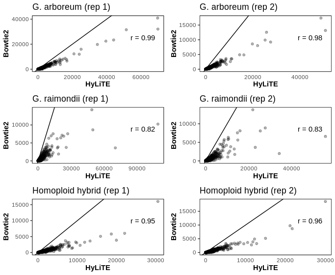

# multi_bowtie
Allopolyploids are formed from mating between species that also causes in an increase in the chromosomal complement of the resulting hybrid offspring. Homoploid hybrid species also form from interspecific mating, but inherit the same number of chromosomes as their parental species.

[HyLiTE](https://hylite.sourceforge.io/index.html) is a program capable of assigning parental origin to high-throughput RNA-seq reads from allopolyploid and homoploid hybrids, through its implementation of [Bowtie 2](http://bowtie-bio.sourceforge.net/bowtie2/index.shtml). Usage of HyLiTE is much less frequent and widespread than Bowtie 2. To validate HyLiTE data, one can generate read count matrices in Bowtie 2 and compare these to the read count matrices generated for the same data by HyLiTE. For the HyLiTE data to be considered robust, we would expect a high correlation coefficient from the regression analysis of the Bowtie 2 and HyLiTE read count data.

## Description
Given the natural variability in gene expression between organisms of the same species, transcriptomic analyses are best performed using biological replicates for each constituent member of the study system.

The scripts `multi_bowtie.py` and `index_sam.py` were written in python, for successive use to automate the processing of a directory of fastq files.

## Installation
To install the required scripts, first clone the **multi_bowtie** repository.
```python
git clone https://github.com/annabehling/multi_bowtie
```

## File note

The code in the following sections (**Preliminary quality filtering** and **Running**) requires similar input to HyLiTE: a directory of `fastq` files and a reference gene sequence `fasta` file. These have not been provided here. However, example output `tsv` files used in later visualisations have been provided.

## Preliminary quality filtering
There are a number of optional or prerequisite steps before the implementation of `multi_bowtie.py` and `index_sam.py`. To ensure that the RNA-seq reads are being mapped accurately (high quality) and unambiguously (adequate length), they can be filtered and trimmed using [SolexaQA](http://solexaqa.sourceforge.net/).

First, [download the latest version](https://sourceforge.net/projects/solexaqa/files/) of SolexaQA.

Next, to filter the reads to have a phred score greater than 30, move to the directory containing the fastq files and run:
```
SolexaQA++ dynamictrim -h 30 *.fastq
```

The quality-trimmed files have the extension `.fastq.trimmed`.

Finally, to keep only reads whose length is greater than 50 bp, in the same directory run `auto_trim.py`:
```
python3 auto_trim.py .         
```
A script is needed to automate this stage as the `SolexaQA++ lengthsort` function can only take one single-end fastq file as an argument at a time.
The quality-trimmed and length-sorted files have the extension `.fastq.trimmed.single`.

## Running
Now, to perform the stringent mapping with Bowtie 2. What makes this mapping highly stringent is the allowance of zero mismatches during the mapping process.

The first step is to build a reference database from the gene sequences that the quality filtered reads will be mapped against.
Move to the directory where the reference gene sequences `gene_file.fasta` are, and run:
```
bowtie2-build -f gene_file.fasta db_name
```

Then, use `multi_bowtie.py` to produce Sequence Alignment/Map (SAM) files for all of the quality-trimmed and length-sorted fastq files against the reference database:
```
python3 multi_bowtie.py db_name .
```

Lastly, use `index_sam.py` to gain index statistics from the resulting SAM files:
```
python3 index_sam.py .
```

## Output
The above code produces a number of tsv files containing Bowtie 2 index statistics; one tsv file for each original fastq file.
Each tsv file has four columns: reference sequence name, sequence length, number of mapped reads, number of unmapped reads. Example tsv files can be found [here](https://github.com/annabehling/multi_bowtie/tree/master/files "example tsv files").

Functions and example code for processing these output files into a format suitable for visualisation can be found in `multi_bowtie_vis.R`. These have been tested to work on R version 4.0.3.

## Visualisations

Once the code in `multi_bowtie_vis.R` has been run, the resulting figure should look like this:



Data is shown for two replicates (L-R) of the parental species *Gossypium arboreum* and *G. raimondii*, and their homoploid hybrid. Points on the plots have 30\% opacity, to emphasise overlap. Each plot shows a linear trend line (x = y).

The high correlation coefficients (0.82-0.99) produced from the regression analysis of the HyLiTE and stringent mapping read count data gives confidence in the HyLiTE data, as does the limited variation from a linear trend line. The regression analyses are not centered on the linear trend lines because the high stringency mapping was performed with no mismatches, in addition to the preliminary quality filtering.

The example output visualisation, `bowtie_v_hylite.png` can be also found in `files/`.

## Additional code

This repository also contains the file `igv_picker.R` which can be used to generate short-lists of candidate genes in the high, mid and low expression categories for manual IGV mapping. This has also been tested to work on R version 4.0.3.
